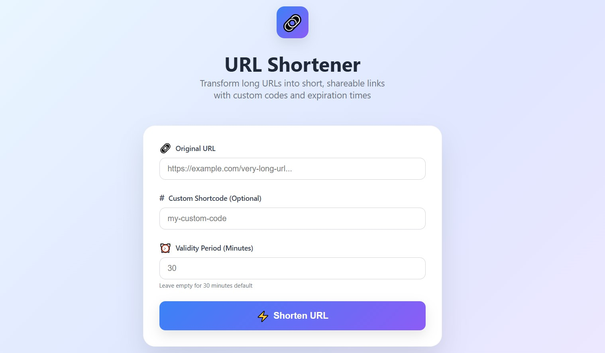
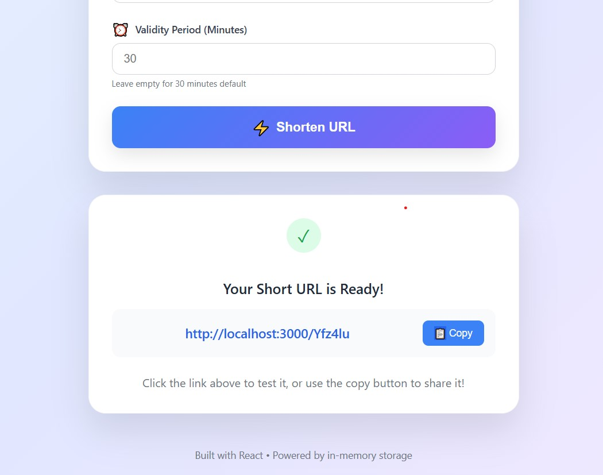

```md
# 🔗 URL Shortener — Frontend Project

**Roll Number:** 2200971640042  
**Submission Sections:**
- `FrontendTestSubmission/`: React-based URL Shortener  
- `LoggingMiddleware/`: Reusable frontend logger  

---


## 📸 Screenshots
 |  


---

## ⚙️ Features

- URL shortening with optional custom shortcode  
- Expiry time for each link (default: 30 minutes)  
- In-memory storage for simplicity  
- Reusable logger with:  
  - Log levels: info, error, warn  
  - Sends logs to external API using Bearer Token  

---

## 📁 Folder Structure

```

2200971640042/
├── LoggingMiddleware/
│   └── logger.js
│
└── FrontendTestSubmission/
├── public/
├── src/
│   ├── App.js
│   ├── logger.js (or imported from ../LoggingMiddleware)
│   └── components/
│       ├── ShortenerForm.jsx
│       └── RedirectHandler.jsx
├── package.json
└── ...

````

---

## 🧪 How to Run Locally

```bash
cd FrontendTestSubmission
npm install
npm start
````

Then open `http://localhost:3000` in your browser.

---

## 📦 Logging Configuration

* Uses `fetch` to send POST logs to:
  `http://20.244.56.144/log`
* Authorization handled via static Bearer token
* Used in both components for lifecycle and error logs

---

## 📄 Additional Notes

* Built using React + Tailwind CSS
* Fully client-side; uses `window.shortLinks` for temp storage
* No backend used

---

## ✅ Submitted By

**Name:** Ritwik Chandra
**Roll No:** 2200971640042
**Institute:** Galgotias College Of Engineering And Technology

---

```

